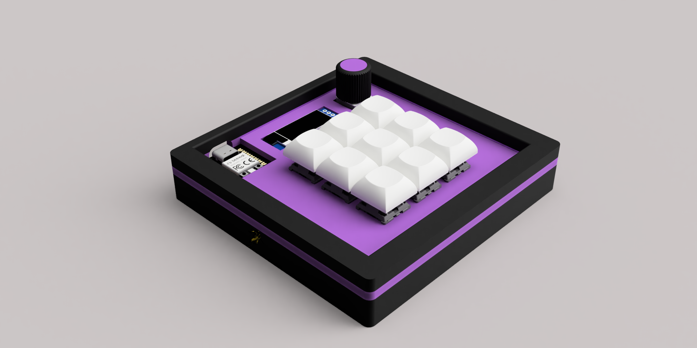
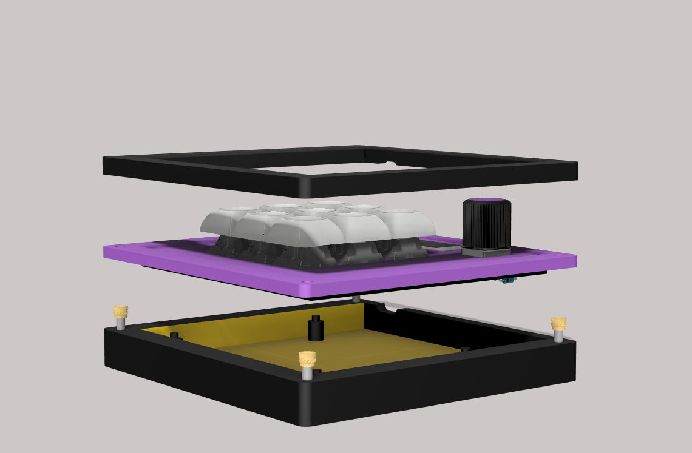
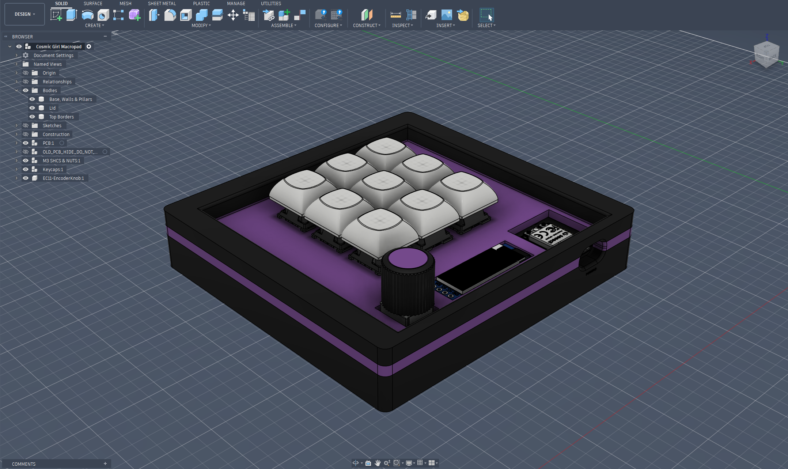
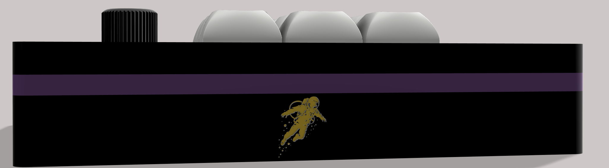
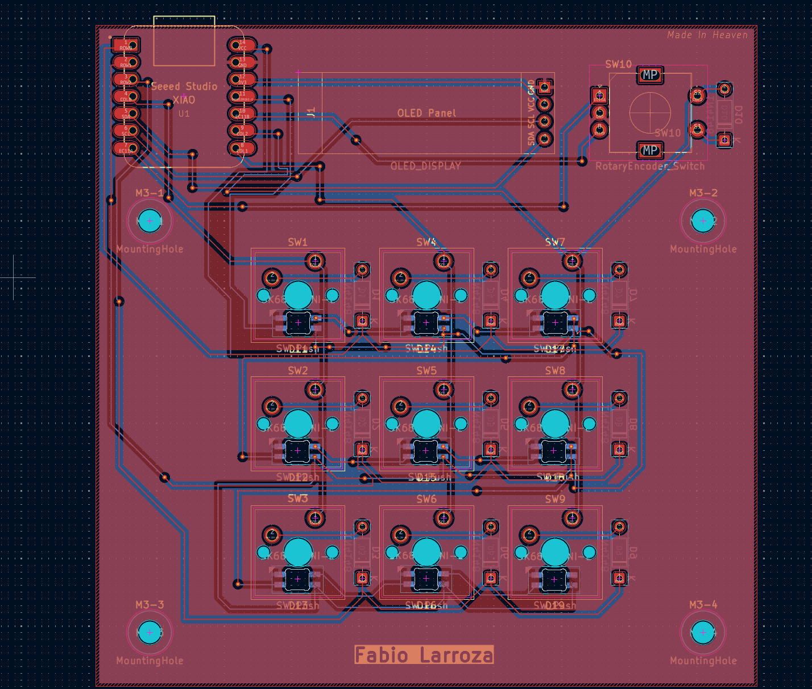
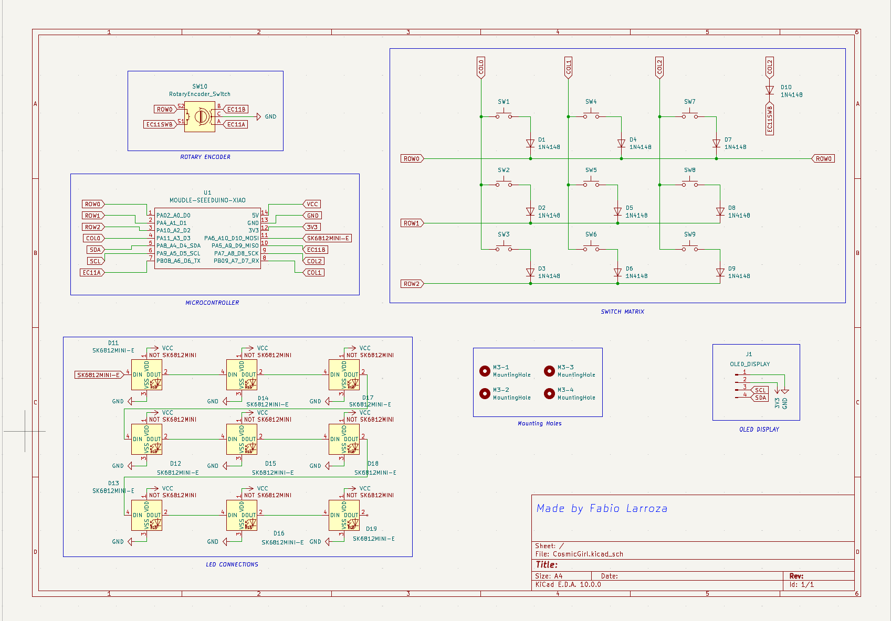
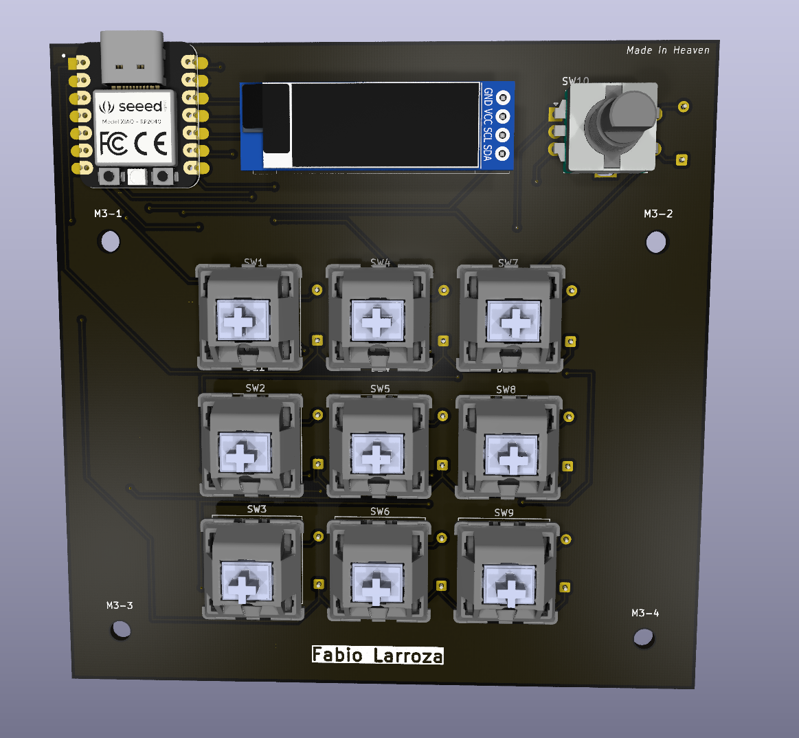
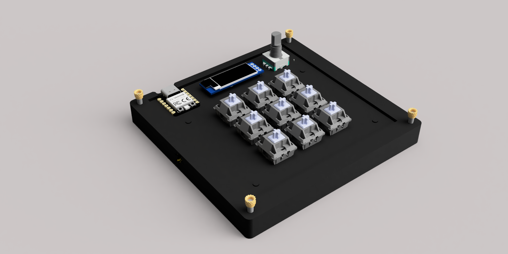

# Cosmic-Girl-Macropad
A personal cosmic-themed XIAO-RP2040-powered HackPad for games, video editing, or whatever you'd like to optimize. It features 9 MX-style switches, 1 EC11 rotary encoder, and a 128x32 OLED screen.

Having 9 keys makes it perfect for media editing and streaming; those are the main usages I want to give it. Of course, this macropad would work for anything else that allows custom binds. KMK firmware written in Python, is open to modifications 

It is called "Cosmic Girl" because I really like the song of the same name created by the band "Jamiroquai," and also space aesthetics.

Made using KiCad, Fusion 360, and Visual Studio Code. For Hack Club Blueprint.

## Render & Snapshot - Fusion 360

---
## PCB & Schematic - KiCad 

---
## 3D

---
## Bill of Materials

| Part | Quantity | Details |
|------|----------|-------|
| Seeed XIAO RP2040 | 1 | Unsoldered |
| 1N4148 Diode | 10 | Through-hole |
| MX-Style Switch | 9 | |
| EC11 Rotary Encoder | 1 | D-Shaft |
| 0.91" OLED Display | 1 | I2C, 128x32 |
| DSA Keycap (white blank) | 9 | |
| SK6812 MINI-E LED | 9 | |
| M3x16mm Screw | 4 | |
| M3x5x4mm Heatset Insert | 4 | |
| Custom PCB | 1 | 2-layer, 98x98mm|

---
## Attribution
Rotary encoder knob model adapted from [EC11 Encoder Knob](https://www.printables.com/model/1000044-ec11-encoder-knob) by Kea Workshop, licensed under GNU GPL v2.0